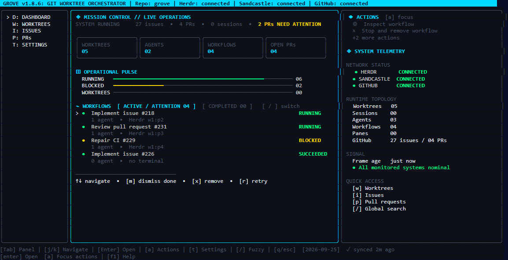

# Grove — Worktree and Workflow Mission Control

> Manage Git worktrees, follow GitHub issues and pull requests, run agent workflows through the Sandcastle runtime in Herdr panes, and watch every run from one terminal interface.




---

## Why Grove?

Modern software development means juggling several things at once: features in flight, pull requests waiting for review, issues to reference, and agents working on some of it. Keeping all of that in sync is genuinely painful.

**The problems Grove solves:**

- **Context-switching hell.** Stashing changes, checking out branches, losing your editor state, repeating. Git worktrees are the answer, but their CLI is easy to forget. Grove puts every worktree on one screen and jumps between them instantly.

- **The five-app shuffle.** A terminal for git, a browser for GitHub, another terminal for the agent, a chat for the PR link. Grove brings worktrees, pull requests, issues, workflows, and their agents into one screen.

- **Agents in the wrong place.** An agent started in the wrong checkout wastes a run. Grove starts each workflow with the issue or pull request, repository, and worktree it belongs to, in its own Herdr pane.

- **"Which branch had that issue again?"** Grove links issues and pull requests to their worktrees, so you always know what is where.

---

## Features

- **Mission control dashboard** — live cards for worktrees, agents, workflows, and open pull requests, an operational pulse, and a workflow list split into *Active / Attention* and *Completed*
- **Sandcastle workflows** — implement an issue (`imp`), review a pull request (`review`), act on review feedback on your own pull request (`address`), repair failing CI (`ci`), resolve merge conflicts (`resolve`), and clean up merged work (`clean`), each started from a context-aware Actions panel and run in a Herdr pane
- **Mission inspector** — press `v` on a workflow for its overview, steps, metrics, agent activity, and the **reports** it wrote, such as the implementation report and review verdict, rendered in the terminal
- **Worktree management** — create a worktree from an issue or pull request, open it, open a separate shell, close a session, delete it with its local branch, and clean up merged work
- **GitHub sync** — pull requests, issues, reviews, comments, checks, and merge state fetched through the `gh` CLI, refreshed in the background when auto sync is on
- **Team-aware PR attention** — flags your pull requests with requested changes, unresolved threads, failing checks, or conflicts, and teammates' pull requests waiting on your review
- **Issue hierarchy** — parent and sub-issues shown as a tree; a sub-issue's worktree can branch from its parent's branch
- **Global fuzzy finder** — `/` or `Ctrl+F` searches worktrees, issues, pull requests, files, branches, commits, and workflow runs as you type
- **Settings screen** — `t` opens a fullscreen settings screen with every option, its config key, and a description
- **23 built-in themes** — 16 dark and 7 light, picked from a list with a live preview
- **Mouse support** — click the navigation rail, rows, tabs, and actions; scroll with the wheel
- **Self-update** — Grove checks for a new release on startup and can replace its own binary
- **Local persistence** — configuration in `~/.grove/config.toml`, a SQLite cache so Grove starts fast

---

## Prerequisites

| Requirement | Notes |
|---|---|
| [Git](https://git-scm.com/) | Must be on `PATH` |
| [GitHub CLI (`gh`)](https://cli.github.com/) | Run `gh auth login` before first use. For project board status, also grant the `read:project` scope: `gh auth refresh -h github.com -s read:project` |
| [Herdr](https://github.com/herdrdev/herdr) | Needed to run workflows, which open in Herdr panes. The platform installers install it when it is missing |
| An agent backend | OpenCode, Pi, or Claude Code, used by workflows. See [Agent Backends](#agent-backends) |
| Go 1.25+ | Only to build from source |
| Node.js 22+ | Only to build the Sandcastle runtime from source or run its tests |

---

## Installation

### Linux / macOS

```bash
curl -sSL https://raw.githubusercontent.com/m00nk0d3/grove/main/install.sh | bash
```

Detects your OS and architecture and installs Grove to `/usr/local/bin`. It also
installs a private Node.js 22 and Grove's Sandcastle runtime under
`~/.local/share/grove`. If Herdr is not on `PATH`, the latest Herdr release is
installed there too. Set `GROVE_INSTALL_DIR` or `GROVE_DATA_DIR` to change those
locations, and `GROVE_VERSION` to install a specific release.

### Windows (PowerShell)

```powershell
irm https://raw.githubusercontent.com/m00nk0d3/grove/main/install.ps1 | iex
```

Installs the latest `windows_amd64` release of Grove, a private Node.js, and the
Sandcastle runtime under `%LOCALAPPDATA%\grove\`, installs Herdr when it is
missing, and adds the directory to your user `PATH`. Restart your terminal
afterwards.

Both installers install the workflow commands `grove-sandcastle`, `imp`
(alias `agent-flow`), `review`, `address`, `ci`, `resolve`, and `clean`.

### go install

```bash
go install github.com/m00nk0d3/grove/cmd/grove@latest
```

Requires Go 1.25+ and installs only the Grove binary. Without the Sandcastle
runtime, workflows cannot start; use a platform installer, or build from source
as below.

### Build from source

```bash
git clone https://github.com/m00nk0d3/grove
cd grove
make build            # the grove binary
make install-runtime  # the Sandcastle runtime and workflow commands (needs Node.js)
./grove
```

`make install` does both and installs `grove` with `go install`.

> Pre-built release archives are also on the [GitHub Releases page](https://github.com/m00nk0d3/grove/releases).

---

## Quick Start

1. `cd` into a Git repository — inside a Herdr pane if you want to run workflows
2. Run `grove`
3. Grove opens on the **Dashboard**. `j`/`k` select a workflow, `Enter` jumps to its Herdr pane, and `v` opens the mission inspector
4. Press `i` for **Issues**, select one, and press `Enter` to create a worktree for it
5. Press `a` to focus the **Actions** panel for the selection, choose *Implement issue* with `j`/`k`, and press `Enter` to start `imp`
6. Watch the run on the dashboard; once it finishes, `v` then `5` shows its implementation report

---

## The Screen

| Area | What it shows |
|---|---|
| **Header** | Grove's version, the repository, active sessions, and whether Herdr, Sandcastle, and GitHub are connected |
| **Navigation rail** | The views: `D` Dashboard, `W` Worktrees, `I` Issues, `P` PRs, `T` Settings |
| **Main panel** | The current view |
| **Context panel** | Details of the selection and its **Actions** |
| **Footer** | Key hints, the date, and when GitHub was last synced |

`Tab` moves focus between the navigation rail, the main panel, and the context panel.

---

## Keybindings

### Everywhere

| Key | Action |
|---|---|
| `d` / `w` / `i` / `p` | Dashboard / Worktrees / Issues / PRs view |
| `t` | Open settings |
| `/` / `Ctrl+F` | Open the fuzzy finder |
| `f1` / `?` | Open help |
| `r` | Refresh worktrees and GitHub now, and Herdr and Sandcastle status |
| `q` / `Esc` / `Ctrl+C` | Quit |

### Lists and panels

| Key | Action |
|---|---|
| `↑` / `↓` or `j` / `k` | Move the selection |
| `Tab` | Cycle focus: navigation rail, main panel, context panel |
| `Enter` | Open the selection (see below) |
| `a` | Focus the Actions panel |
| `J` / `K` | Scroll the context panel |
| `PgDn` / `n`, `PgUp` | Next / previous page of issues or pull requests |
| Mouse | Click rail items, rows, tabs, and actions; scroll with the wheel |

`Enter` depends on the view:

| View | `Enter` does |
|---|---|
| Dashboard | Jump to the selected workflow's Herdr pane; on *Completed*, open the mission inspector |
| Issues | Jump to the issue's workflow or session, or create a worktree for it |
| PRs | Jump to the pull request's session, or check it out into a new worktree |
| Worktrees | Jump to the worktree's workflow pane, or open or focus its shell |
| Actions panel | Run the selected action |

### Dashboard

| Key | Action |
|---|---|
| `[` / `]` | Switch between *Active / Attention* and *Completed* workflows |
| `v` | Open the mission inspector for the selected workflow |
| `x` | Stop and remove the selected workflow (asks first) |
| `m` | Mark a succeeded workflow done, moving it to *Completed* |

### Mission inspector

| Key | Action |
|---|---|
| `1`–`5`, `Tab` / `Shift+Tab`, `h` / `l` | Overview, Steps, Metrics, Implementation, Reports |
| `j` / `k` | Select a step, or scroll a report |
| `PgUp` / `PgDn`, `g` / `G` | Page through a report, or jump to its start or end |
| `[` / `]` | Previous / next report |
| `Enter` | Jump to the workflow's Herdr pane |
| `r` | Refresh the run and reload its reports |
| `t` | Retry a failed run |
| `x` | Stop and remove the run (asks first) |
| `Esc` / `q` | Close |

### Settings

| Key | Action |
|---|---|
| `Tab` / `Shift+Tab`, `1`–`4` | Switch section |
| `↑` / `↓` or `j` / `k` | Move the selection |
| `Enter` | Apply a theme, toggle a switch, advance a choice, or edit a value |
| `←` / `→` | Change a choice |
| `Esc` / `q` | Close |

---

## Workflows

The **Actions** panel lists what can be done with the current selection. Press
`a` to focus it, select an action with `j`/`k`, and press `Enter`.

| Selection | Actions |
|---|---|
| Issue | Implement issue (`imp`), open on GitHub |
| Pull request | Review (`review`), address review feedback (`address`), repair CI (`ci`), resolve conflicts (`resolve`), open on GitHub |
| Worktree | Open, open a separate shell, close the session, delete the worktree and its local branch, clean merged work (`clean`) |
| Dashboard workflow | Inspect, retry a failed run, mark a succeeded run done, stop and remove, clean merged work (`clean`) |
| Anywhere | Sync GitHub now |

Deleting a worktree never deletes its remote branch, and Grove refuses to delete
the default branch.

Each workflow opens in its own Herdr tab, and its progress appears on the
dashboard. The same commands can be run directly from a Herdr pane:

```bash
imp 42                   # implement issue 42 (also: imp owner/repo 42)
imp 42 --full            # force the full workflow; --lean forces the lean one
imp 42 --refresh-profile # re-establish the repository's project profile first
review 17                # review pull request 17 (also: review owner/repo 17)
address 17               # act on the review feedback left on pull request 17
ci 17                    # repair pull request 17's failing checks
resolve 17               # resolve pull request 17's merge conflicts
clean                    # remove merged worktrees and branches
```

`imp` picks the lean or full workflow from the issue itself; `--lean` and
`--full` override that choice. `address --continue` and `ci --continue` resume a
run that stopped with its changes still in the worktree.

### Address review feedback

`address` works the other way round from `review`: instead of reviewing someone
else's pull request, it takes the feedback left on **yours** — unresolved review
threads, "changes requested" review bodies, and pull request comments — and
makes the code changes they ask for. It checks out the pull request branch,
works through each item, validates, then commits and pushes.

A reviewer's **suggested change** is their literal replacement for the lines the
thread sits on, so it is passed through verbatim and applied as written unless
it is wrong. An **approved** pull request is still fair game: notes left
alongside an approval count as feedback, and the run warns you when pushing
might dismiss that approval.

It does not write to the conversation. Replying to reviewers and resolving
threads stays with you, and the agent's final response lists what it did for
each item, including anything it deliberately did not change and why. Threads
marked outdated are shown to the agent as outdated, so it checks the current
code rather than redoing work that has already landed.

### Review specialists

After the implementation is verified, a workflow runs additional review stages —
but only the ones the diff calls for, so an ordinary change is no slower. The
review audits only, and hands blockers back to the implementation specialist
rather than fixing them itself.

| Concern | Raised when the diff touches | Reviews |
| --- | --- | --- |
| security | auth, roles, policies, sessions, middleware, CORS, secrets, app settings | Authorization coverage, untrusted input, leaked credentials, transport and browser protections, sensitive data |
| database | migrations, `.sql`, schema definitions, entities, seed routines | Destructive operations, additive-only compliance, backfills, index and cascade impact, rollback cost |
| API contract | controllers, routes, handlers, endpoints, DTOs, API clients | An interface change staying consistent across every layer that declares, produces, or consumes it |

Whichever concerns a diff raises are reviewed together in one `domain-review`
stage, each against its own checklist, so three concerns cost one agent run.
The review loop runs at most `AGENT_FLOW_MAX_REVIEW_PASSES` passes (5 by
default, 1–10).

The `documentation` stage follows the repository's stated obligations, and
leaves a generated changelog to the release tooling that owns it.

### Stack detection and validation

Grove identifies **every** stack in the repository, not just one. Each project
is found by its marker file, searching the repository root and up to two levels
below it, and a directory that owns a project is not searched again — so a
solution's individual projects and a workspace's packages do not each count.

| Marker | Stack | Validated with |
| --- | --- | --- |
| `go.mod` | Go | `go test ./...` |
| `pyproject.toml` or `requirements.txt` | Python | `python -m pytest` |
| `*.sln`, `*.slnx`, or `*.csproj` | .NET | `dotnet test <solution>` |
| `package.json` | TypeScript | `npm test` |

Rust, Java, Scala, Ruby, PHP, Elixir, Deno, Swift, Dart, Haskell, and CMake
projects are recognised and named, but have no validation command.

In a repository holding more than one stack:

- **Validation runs per project, where the project lives**, and only for the
  projects the diff touches. A change that cannot be attributed to any project
  validates all of them rather than guessing.
- **The implementation persona names every stack and the directory that owns
  it**, so the agent follows the conventions of whichever tree it is editing.

For example, a repository with `backend/App.sln` and `frontend/package.json`
validates a backend change with `dotnet test App.sln` run inside `backend/`,
and a frontend change with `npm test` run inside `frontend/`.

Validation reports progress every 30 seconds, stops a command that runs longer
than `AGENT_FLOW_VALIDATION_TIMEOUT_MS` (30 minutes by default), and skips a
run when the worktree and planned commands are unchanged since the last pass.
Set `AGENT_FLOW_REVALIDATE_ALWAYS=1` to validate every time.

### Agent backends

Every workflow launches its specialists through the same backend, selected by
`sandcastle.default_agent` (in the settings screen's **Agents** section or
`config.toml`) and forwarded to Herdr as the agent kind.

| Backend | Requires | Notes |
| --- | --- | --- |
| `opencode` | OpenCode, LM Studio (default model) | Default. Writes artifacts with shell redirection. |
| `pi` | Pi, LM Studio or Bonsai | Uses the compaction guard extension for context continuity. |
| `claude` | [Claude Code](https://claude.com/claude-code) | Writes artifacts with its native `Write` tool. No local model server needed. |

The backend is passed to the workflow process as `AGENT_FLOW_AGENT_BACKEND`.
A workflow started directly from a shell (for example `imp 42`) without that
variable reads `[sandcastle].default_agent` from `~/.grove/config.toml`, and
falls back to `opencode` only when neither is set.

| Variable | Backend | Default |
| --- | --- | --- |
| `AGENT_FLOW_OPENCODE_MODEL` | `opencode` | `lmstudio/qwen/qwen3.5-9b` |
| `AGENT_FLOW_OPENCODE_AGENT` | `opencode` | `build` |
| `AGENT_FLOW_PI_PROVIDER` | `pi` | `lm-studio` |
| `AGENT_FLOW_PI_MODEL` | `pi` | `qwen/qwen3.5-9b` |
| `AGENT_FLOW_CLAUDE_MODEL` | `claude` | the Claude Code session default |
| `AGENT_FLOW_CLAUDE_PERMISSION_MODE` | `claude` | `acceptEdits` |
| `AGENT_FLOW_CLAUDE_TOOLS` | `claude` | `Read,Write,Edit,Bash,PowerShell,Glob,Grep` |
| `AGENT_FLOW_HUMAN_INPUT_TIMEOUT_MS` | all | `900000` (15 minutes) |
| `AGENT_FLOW_MAX_REVIEW_PASSES` | all | `5` |
| `AGENT_FLOW_VALIDATION_TIMEOUT_MS` | all | `1800000` (30 minutes) |
| `AGENT_FLOW_REVALIDATE_ALWAYS` | all | unset |

### When an agent needs you

An agent can stop for something only a person can decide — a permission prompt,
a credential, a judgement call. Rather than failing the stage, Grove focuses
that agent's Herdr pane and waits:

```
[Input Needed] af-pull-request-reviewer-1160-49 is waiting for a person.
Answer it in its Herdr pane; the workflow resumes on its own once the agent is
idle again (waiting up to 900s).
```

Answer in the pane and the workflow carries on by itself. Set
`AGENT_FLOW_HUMAN_INPUT_TIMEOUT_MS=0` to fail immediately instead, for
unattended runs.

### Reports

Workflows write reports about their runs: an implementation run its
implementation report and review verdict, a review run one review per reviewed
head, and a CI run a summary of the failing checks. Open the mission inspector
with `v` and press `5` to read them. They are kept in the repository's shared
git directory, so they remain readable after the run's worktree is removed.

---

## Issue Hierarchy

Grove understands GitHub's parent and sub-issues. In the **Issues** view:

- Issues are shown as a tree, so you always see a sub-issue's parent
- Creating a worktree for a sub-issue (`Enter`) offers the parent's branch as
  the base, so the sub-issue's pull request targets the parent's branch
- If the parent has no worktree yet, Grove warns you and offers to create the
  parent's worktree first, instead of silently basing the sub-issue on the
  default branch

---

## Fuzzy Finder

Press `/` or `Ctrl+F` anywhere to search, as you type, across:

| Result | `Enter` does |
|---|---|
| Worktrees | Select the worktree in the Worktrees view |
| Issues, pull requests | Select the issue or pull request in its view |
| Files | Open the file in `$EDITOR` |
| Branches | Offer to check the branch out into a worktree |
| Commits | Open the commit on GitHub |
| Workflow runs, finished ones included | Open the run in the mission inspector, with its reports |

`Esc` closes the finder without acting.

---

## Configuration

Grove reads `~/.grove/config.toml`. Every field is optional; a missing file
means the defaults below. The settings screen (`t`) edits the same file and
writes it when you change something.

```toml
[appearance]
# UI theme. Pick one in the settings screen, or set any of:
#   dark:  "digital-noir", "matrix", "cyberpunk", "synthwave", "tokyonight",
#          "catppuccin", "dracula", "nord", "kanagawa", "rose-pine", "onedark",
#          "gruvbox", "everforest", "solarized-dark", "monokai", "ayu-mirage"
#   light: "light", "github-light", "catppuccin-latte", "solarized-light",
#          "rose-pine-dawn", "tokyonight-day", "gruvbox-light"
theme = "digital-noir"

[github]
# Refresh issues and pull requests in the background. When false, they are
# refreshed only at startup and when you press r.
auto_sync = true
# Minutes between background refreshes.
sync_interval_minutes = 5

[worktrees]
# Branch new worktrees start from when no parent branch is picked. When the
# repository has no such branch, its default branch is used instead.
base_branch = "main"
# Where new worktrees are created, one folder per repository:
# <worktree_root>/<repository>/<branch>. A relative path starts at the
# repository root; the default puts them beside the repository.
worktree_root = "../worktrees"

[sandcastle]
# Track and start workflows through the Sandcastle runtime.
enabled = true
# The runtime's command.
binary = "grove-sandcastle"
# Agent that runs workflow specialists: "opencode", "pi", or "claude".
default_agent = "opencode"

[herdr]
# Open worktrees and workflows in Herdr panes, and show Herdr's status.
enabled = true
# Create worktrees through Herdr when Grove runs inside it.
prefer_worktree_api = true
# Seconds between checks of Herdr and Sandcastle status.
poll_interval_seconds = 5
```

The Herdr integration is active only when Grove runs inside a Herdr pane.

### Where Grove keeps things

| Path | Contents |
|---|---|
| `~/.grove/config.toml` | Configuration |
| `~/.grove/grove.db` | SQLite cache of GitHub data and sessions |
| `~/.grove/logs/grove.log` | Log file |
| `<repo>/.git/grove-workflows/` | One record per workflow run |
| `<repo>/.git/agent-flow/` | Workflow checkpoints, reports, and the project profile |

`<repo>/.git` is the repository's shared git directory, which every worktree of
the repository uses.

---

## Staying Up to Date

Grove checks for a new release on startup and offers to update. Updating
replaces the `grove` binary in place; when it lives somewhere you cannot write
to, the new binary is staged and Grove shows the command that installs it.
The update replaces only `grove` — re-run the platform installer to update the
Sandcastle runtime as well.

`grove --version` prints the installed version.

---

## Troubleshooting

| Symptom | Fix |
|---|---|
| Empty issues / PRs list or "gh: not logged in" | Run `gh auth login` and follow the prompts |
| Header shows **Sandcastle: unavailable** | Re-run the platform installer, or run `make install-runtime` for a source build. Set `sandcastle.binary` if the runtime lives elsewhere |
| Header shows **Herdr: unavailable** or workflows do not start | Start Grove inside a Herdr pane; workflows open in Herdr tabs |
| A workflow stays *running* after its pane closed | Press `r`; a run whose process has exited is marked *failed*. Remove it with `x` |
| No worktrees visible | Ensure Git is installed and on `PATH`: `git --version` |
| Deleted worktrees still appear | Run `git worktree prune` in the repository, then press `r` |
| Warning banner on startup | Check `~/.grove/config.toml` for TOML syntax errors; deleting it restores the defaults |

For more, press `f1` inside Grove and open the **Troubleshooting** tab, or see
[docs/RUNBOOK.md](docs/RUNBOOK.md).

---

## Contributing

Contributions are welcome — see [CONTRIBUTING.md](.github/CONTRIBUTING.md) for
the project layout, how to build and test the Go application and the TypeScript
runtime, and the branch and commit conventions.

---

## License

Grove is released under the [MIT License](LICENSE).
